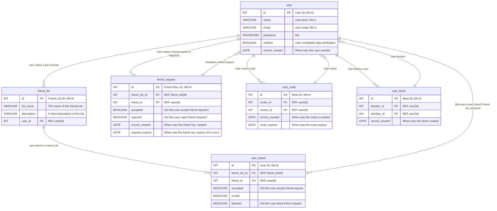

# Entity Relationship Diagram

> **DEPRICATED** This document has been replaced with other documents. Eventually, this document will be removed.

## Abbreviations

In an Entity Relationship Diagram we can indicate if a column is a primary key (`PK`) for foreign key (`FK`). However, due to the limitation of Mermaid we can't indicate the size of `VARCHAR` or `DECIMAL` values.

The ER Diagram structure also doesn't seem to have any place to indicate if values are required, unique, or where foregin keys are referenced.

To fix that problem, I (Jason) decided to make use of the fourth column, which is used for comments, so that those descriptions are part of the diagram.

| Abbreviation | Syntax           | Meaning |
|--------------|------------------|---------|
| `PK`         | `PRIMARY KEY`    |  |
| `FK`         | `FOREIGN KEY`    |  |
| `NN`         | `NOT NULL`       | this field cannot be unfilled |
| `AI`         | `AUTO_INCREMENT` | static unique value assigned to a record |
| `U`          | `UNIQUE`         | this value should be unique, no other records should have the same value |
| `REF table(col)` | `REFERENCE this_column FOREIGN KEY table(col)` | What should this foreign key reference? |

### TODO

- [ ] Should we include abbreviations for `CASCADE ON UPDATE` or `CASCADE ON DELETE`?

## User, User Profile, User Settings, and Families

This diagram describes the relationship between a `user` and two other tables `user_profile` and `user_settings`, as well as `family` and `family_user`

### Routes

#### User (9)

> Note: The relation between a user and books is described in the next diagram

> NOTE: Books Lists are in the third diagram.

| Request  | Route                     | Action |
|----------|---------------------------|--------|
| `POST`   | `/api/user/new`           | Create a new user |
| `GET`    | `/api/user/search/:query` | User search |
| `GET`    | `/api/user/:id`           | Get a user |
| `PUT`    | `/api/user/:id`           | Update a user |
| `DELETE` | `/api/user/:id`           | Delete a user |
| `GET`    | `/api/user/:id/profile`   | Get a user's profiles |
| `PUT`    | `/api/user/:id/profile`   | Update user's profile |
| `GET`    | `/api/user/:id/settings`  | Get a user's settings |
| `PUT`    | `/api/user/:id/settings`  | Update user's settings |

#### Family Routes (8)

| Request  | Route                           | Action |
|----------|---------------------------------|--------|
| `POST`   | `/api/family/new`               | Create a new family |
| `GET`    | `/api/family/:family_id`        | Get a family and list of family members |
| `PUT`    | `/api/family/:family_id`        | Update a family |
| `DELETE` | `/api/family/:family_id`        | Delete a family |
| `POST`   | `/api/family/:family_id/new`    | Add a family member |
| `GET`    | `/api/family/:family_id/:fm_id` | Get a family member |
| `PUT`    | `/api/family/:family_id/:fm_id` | Update a family member |
| `DELETE` | `/api/family/:family_id/:fm_id` | Remove a family member |

### Notes

- In `user_settings`, `show_fav_books` and `show_fav_authors` relates to `user_favorite_books` and `user_favorite_authors` which appear in the next diagram. I decided to not include them in this diagram in order to simplify the appearance if this diagram.

### Features

- **Records should probably have dates on them indicating when the were created.** Just to experiment, the user table has a column for that which will should automatically create a timestamp. Assume this date is also when the `user_profile` and `user_settings` were created.
- **Boolean to indicate user completed data verification**. You know that part in the sign-up process where you are asked to go to your e-mail and verify your account creation?  This is set to `TRUE` when the user does that.
  - This may require a `PUT` route to `UPDATE` our request.
- **Families** - Creating a family account requires that the parent/guardian create accounts for their children. To establish this, the head of household will need to create accounts for their children. Each child will have an age restriction setting based on their age in their own user profile, but it can be set by their parents.
- **Age restrictions**. If the parents who have problems with books haven't figured it out yet, there *is* a book rating system based on age.  I had like a long explanation for why we have this, but I figure it would have been accused of being "too political" despite the fact that most of these "Culture War" issues are sectarian issues shielding behind politics to avoid any discourse. Let's leave it at that.
  - It should be noted that kids do eventually grow up. And that age restrictions are based on how old the user is.  So if you happen to have a 8 year old turning 9 next year, and you still don't want them to read *Are You There God? It's Me, Margaret* by Judy Blume (which Amazon lists the reading age for this book to be between 9 and 12 years old), the least the parent can do is set the age restrictions to "12+".
- **Account Emancipation** - Every year we hear that story about how "Netflix is going to punish users who don't live in the same house for sharing accounts", but we never see them show us how to separate accounts.  It sort of like how you're still using your parents Netflix account but don't live with them any more. (Or if you are a Millennial or Gen-Zer, how you've probably moved out of your parents house but they are still using your Netflix account. 😆 )  This threat of punishment is probably why people are leaving Netflix, unaware that other streaming services also don't have a solution for this, but at least they don't publicly state "If you don't get your own account, we'll fine you!" (At least not yet. (We're looking at you, Disney+!)) To fix this problem, there should be plans to create an "account emancipation" option.  We should probably call it that since some children actually have to go to court to file for emancipation sometimes so their parents don't have legal custody over them.  Similarly, Family accounts should have this option too after a user turns a specific age, so that their parents don't keep restricting their book access at an age where they are actually mature enough to read specific books.  I would suggest enabling this option for anyone over the age of 13 (or 16 at most) so that young users of a certain age, who were added by their parents when they were younger, are able to have autonomy over what books they can read.  Obviously, this won't give children unfettered access to objectionable material. (That restriction would likely be lifted after they turn 18.)

#### Possible rating system

| Level | Age Access | Notes |
|-------|------------|-------|
| 1     | All Ages   | At this level, young children (even those under five) may access books. Think of this as the "TV-Y" rating. Regardless parents should read with their children. |
| 2     | 6+         | These books are accessible to children over the age of 6.  Think of this as your "TV-Y7" rating. |
| 3     | 9+    | These books are accessible to children over the age of 9. If Mom and Dad aren't ready to start talking to their kids about controversial stuff, they're going to have a bad time being a parent after this point. |
| 4     | 12+   | These books are accessible to children over the age of 12. Teen level reading access granted. |
| 5     | 14+   | These books are accessible to teens over 14. Think of this as the "TV-14" rating. If there is a book you want to read that is above this level, you'll want to ask your parents first. |
| 6     | 16+   | These books are accessible to teens over 16. Account emancipation access may be enabled. If applied, user will have access to almost all books. Obviously, we don't want them reading Ayn Rand or a book by a certain dictator. You'll need to contact a moderator if there's a book you absolutely need to read. |
| 7     | 18+   | Complete full access. You're a legal adult at this point. Have at it! |

### Wish List

- **Death Protocol: What if the user dies?** - Facebook has something like this. The HAM Radio community sends out a "Silent Key" ("/SK") message when a user dies.
  - User could opt to have their records destroyed
  - User could also opt to bequeath their data to another user
- **`user.email` and `user.password` should probably be in their own tables.** If a hacker were to compromise the data of this site, the `user.email` and `user.password` would be in separate tables, and probably further obfuscated by a few bridge tables just to scramble up the data.
  - `user.email` encrypted?
  - The same obfuscation on the `user_profile` table.
- **Better records management**: Indicate when records were created, modified, or deleted.
  - It would also be nice to know who made those changes.  This might require a separate system that has a subtile link to every record in the system for logging.
- **Purge unverified users**: If a user doesn't complete data verification within 30 minutes, the record is deleted.
  - Perhaps to save time, `user_profile` and `user_settings` should not create records for a `user` until the user is verified.

## Users, Books, Authors, Clubs, and Favorites

In this diagram, we show the relationship between Users, Books, and Authors.

- A user will have a list of favorite books, which if enabled in their user settings, may be visible to the public.
- A user will have a list of favorite authors, which if enabled in their user settings, may be visible to the public.
- It should be noted that `user_favorite_books` and `user_favorite_authors` is not the same as the user creating a book list, which will be explained in the next diagram.
- Because some books have more than one author, a `book_author` table was created to associate a book with multiple authors.
  - This is also important to generate an author's bibliography
- The `author` table has a `pen_name` column.
  - Example: "Samuel Clemens" has the pen name of "Mark Twain".

### Routes

#### Book Routes (5)

| Request  | Route | Action |
|----------|-------|--------|
| `GET`    | `/api/book/search/:query` | Search for a book |
| `POST`   | `/api/book/new`           | Create a new book |
| `GET`    | `/api/book/:id`           | Get a book by ID  |
| `PUT`    | `/api/book/:id`           | Update a book's information |
| `DELETE` | `/api/book/:id`           | Delete a book |

#### Author Routes (6)

| Request  | Route | Action |
|----------|-------|--------|
| `GET`    | `/api/author/search/:query`    | Search for an author |
| `POST`   | `/api/author/new`              | Create a new author  |
| `GET`    | `/api/author/:id`              | Get an author by ID  |
| `GET`    | `/api/author/:id/bibliography` | Get a list of the author's books |
| `PUT`    | `/api/author/:id`              | Update an author's information   |
| `DELETE` | `/api/author/:id`              | Delete an author |

#### User Favorites Routes (9)

| Request  | Route                     | Action |
|----------|---------------------------|--------|
| `GET`    | `/api/user/:id/favorite/books` | Get a list of the user's favorite books |
| `POST`   | `/api/user/:id/favorite/books` | Add a book to a user's favorite books |
| `DELETE` | `/api/user/:id/favorite/books` | Remove a book from a user's favorite books |
| `GET`    | `/api/user/:id/favorite/authors` | Get a list of the user's favorite authors |
| `POST`   | `/api/user/:id/favorite/authors` | Add a book to a user's favorite authors |
| `DELETE` | `/api/user/:id/favorite/authors` | Remove a book from a user's favorite authors |
| `GET`    | `/api/user/:id/favorite/clubs` | Get a list of the user's favorite clubs |
| `POST`   | `/api/user/:id/favorite/clubs` | Add a club to a user's favorite clubs |
| `DELETE` | `/api/user/:id/favorite/clubs` | Remove a club from a user's favorite clubs |

#### User Club Routes (6)

> Note: Some of these routes might not be developed due to time constraints on this project

| Request  | Route                     | Action |
|----------|---------------------------|--------|
| `GET`    | `/api/user/:id/clubs`          | Get a list of clubs the user is part of, regardless of position |
| `GET`    | `/api/user/:id/clubs/member`        | Get a list of clubs the user is part of as a club member |
| `GET`    | `/api/user/:id/clubs/moderator`     | Get a list of clubs the user is part of as a club moderator |
| `GET`    | `/api/user/:id/clubs/administrator` | Get a list of clubs the user is part of as an club administrator |
| `GET`    | `/api/user/:id/club_lists`     | Get a list of the user's club lists |
| `GET`    | `/api/user/:id/book_lists`     | Get a list of the user's book lists |

#### Club Routes

> Note: Some of these routes might not be developed due to time constraints on this project

| Request  | Route | Action |
|----------|-------|--------|
| `GET`    | `/api/club/search/:query` | Search for a list of book clubs |
| `POST`   | `/api/club/new`           | Create a new book club |
| `GET`    | `/api/club/:id`           | Show a book club by ID |
| `GET`    | `/api/club/:name`         | Show a book club by it's name |
| `PUT`    | `/api/club/:id`           | Update a book club |
| `DELETE` | `/api/club/:id`           | Delete a book club |
| `GET`    | `/api/club/:id/members`   | Get a list of club members |
| `GET`    | `/api/club/:id/members/search/:query` | Search for members in a club |
| `GET`    | `/api/club/:id/members/members`       | Get a list of club members who are just regular members (not moderator or administrators) |
| `GET`    | `/api/club/:id/members/moderators`    | Get a list of club members who are club moderators |
| `GET`    | `/api/club/:id/members/administrators` | Get a list of club members who are club administrators |
| `POST`   | `/api/club/:id/join`      | Join a book club by ID |
| `POST`   | `/api/club/:name/join`    | Join a book club by name |
| `POST`   | `/api/club/:id/leave`     | Leave a book club by ID (This will delete them from the user roster) |
| `POST`   | `/api/club/:name/leave`   | Leave a book club by name (This will delete them from the user roster) |

### Notes

- To reiterate, `user_favorite_books` is different from creating a `book_list`.

### Features

- To make sure that we don't have any "My Jesus is better than yours" book-burning parents trying to accuse Book Club of peddling *Fifty Shades of Grey* to their five year old that they've never read any Dr. Seuss books to them out of fear that "*The Lorax* made my baby woke", books with explicit content will have age restrictions on them.
  - This is also why `user_profile` has a date of birth (`dob`) field and why `user_settings` has an option to set the age group.

### Wish List items for this diagram

- `publisher` - A table of book publishers
- `book_publisher` - A table linking publishers and books
- `genre` - A category for books and authors
  - Example: "horror"
- `book_genre` - relate `books` with `genre`. What type of book is it?
  - Example: Associating "Pet Semetary" with "horror"
- `author_genre` - relate `author` with `genre`.
  - Example: Associating "Stephen King" with "horror"
- `tag` - A tag associate with various records
- `book_tag` - Associate a book with a tag
- `author_tag` - Associate an author with a tag
- `genre_tag` - Associate a genre with a tag
- `author_pic` - A table of pictures featuring various authors
  - More like an advanced topic in SQL, it is possible to add binary data which stores media files to a database. We can worry about this later.
- `book_pic` - A table of pictures featuring book covers
  - As with as `author_pic`, this will also need to be considered later. Perhaps we should put all pictures into a table that stores binary media then extract it when we need it.
- Better record keeping - establish a universal means to track when records were created, modified, or deleted.

Eventually, we could integrate the Category and Tag examples from previous classwork into our model, but we'll save it for another time.

## User and Club Book Lists

I know that we have a `user_favorite_books` table, however that's not the same as the user having book lists.

### Book List Routes (5)

| Request  | Route | Action |
|----------|-------|--------|
| `GET`    | `/api/user/:id/book_lists`       | Get a list of the user's book lists (I posted this earlier) |
| `GET`    | `/api/user/:id/book_lists/search/:query` | Search a user's book lists |
| `POST`   | `/api/user/:id/book_list/new`    | Create a new book list |
| `GET`    | `/api/user/:id/book_list/:bl_id` | Get a user's book list |
| `PUT`    | `/api/user/:id/book_list/:bl_id` | Update a user's book list (add or remove a book on a list) |
| `DELETE` | `/api/user/:id/book_list/:bl_id` | Delete a user's book list |

### Club List Routes (5)

| Request  | Route | Action |
|----------|-------|--------|
| `GET`    | `/api/user/:id/club_lists`       | Get a list of the user's club lists (I posted this earlier) |
| `GET`    | `/api/user/:id/club_lists/search/:query` | Search a user's club lists |
| `POST`   | `/api/user/:id/club_list/new`    | Create a new club list |
| `GET`    | `/api/user/:id/club_list/:cl_id` | Get a user's club list |
| `PUT`    | `/api/user/:id/club_list/:cl_id` | Update a user's club list (add or remove a club on a list) |
| `DELETE` | `/api/user/:id/club_list/:cl_id` | Delete a user's club list |

### Club Book List Routes (5)

| Request  | Route | Action |
|----------|-------|--------|
| `GET`    | `/api/club/:id/book_lists`       | Get a list of a club's book lists |
| `GET`    | `/api/club/:id/book_lists/search/:query` | Search a club's book lists |
| `POST`   | `/api/club/:id/book_list/new`    | Create a new club book list |
| `GET`    | `/api/club/:id/book_list/:bl_id` | Get a club's book list |
| `PUT`    | `/api/club/:id/book_list/:bl_id` | Update a club's book list (add or remove a book on a list) |
| `DELETE` | `/api/club/:id/book_list/:bl_id` | Delete a club's book list |

## User Favorites

## Clubs

We got the book part taken care of, but what about the club part.

### Club Membership

## Friend Lists

> NOTE: This probably won't be developed

## Site Administration

> NOTE: This probably won't be developed

The people running the site probably should be on a different database. But let's assume that it is in the same database.

A user would be part of the staff.  A staff user would have a supervisor, and that supervisor would manage a list of staff users they would be responsible for. This structure is sort of recursive as staff users report to their staff supervisors who are supervisors, supervisors would report to their staff supervisors which would be company managers or site moderators, and managers would report to their staff supervisors who are likely the administrators or C-Level leaders.

## User Management

> NOTE: This probably won't be developed

