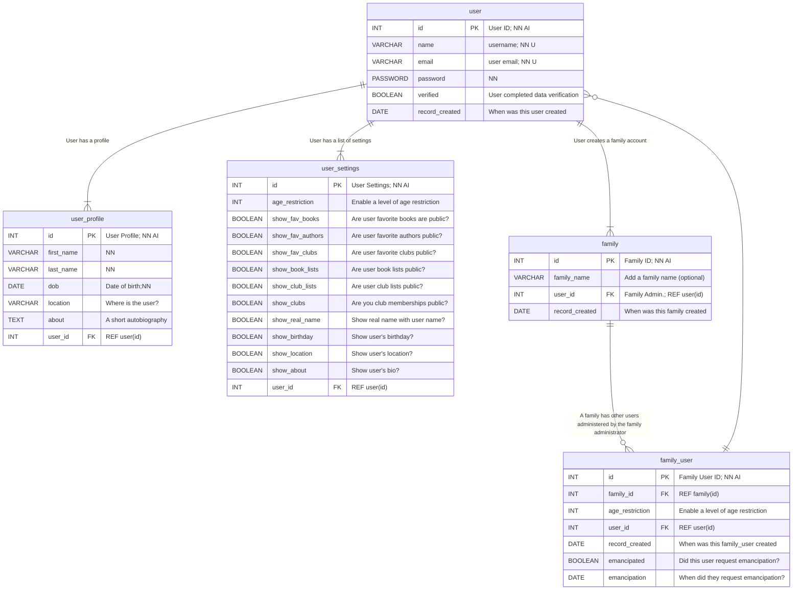

Documentation &raquo; Diagrams &raquo; Figure 1

---

# User, User Profile, User Settings, and Families

This diagram describes the relationship between a `user` and two other tables `user_profile` and `user_settings`, as well as `family` and `family_user`

> TODO: Make sure all the fields we wrote in our classes are used here. Do likewise with the other diagrams if necessary.

