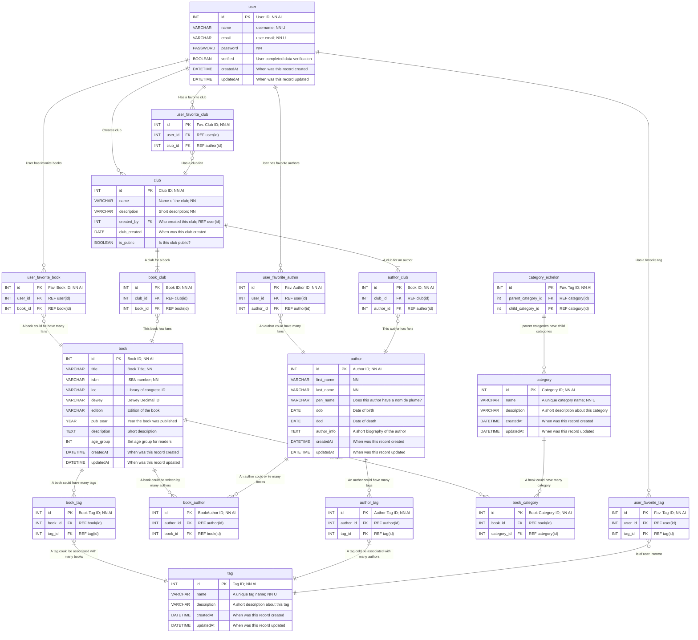

Documentation &raquo; Diagrams &raquo; Figure 2

---

# Users, Books, Authors, Clubs, Favorites, Tags, and Categories

## So what is the difference between a tag and a category?

A **tag** is pretty much a keyword that can be associated with a book.

A **category** (or genre) describes what the book is.

When you think of "category", we are talking about "Fiction" vs "Nonfiction".

Mystery, Romance, Horror, Science Fiction, Fantasy, all of these can be categories. They can also be tags too, though when you look for things by category it is more inline with a specific genre than a specific keyword.

In the realm of non-fiction, think about the [Library of Congress](https://www.loc.gov/catdir/cpso/lcco/) (LOC) Classification Outline or [Dewey Classification System](https://www.oclc.org/content/dam/oclc/dewey/resources/summaries/deweysummaries.pdf) where books are sorted by subject.

Tags can be assigned to books and authors, but categories can only be assigned to books as authors are not limited to just one category.

## ER Diagram

> NOTE: Thanks to Nathan Sebhastian for [explaining how the timestamps work in sequelize](https://sebhastian.com/sequelize-timestamps/).
> Thanks to him, we now can use `timestamps: true`, `createdAt: true`, and `updatedAt: true` to add timestamps to our data objects.

