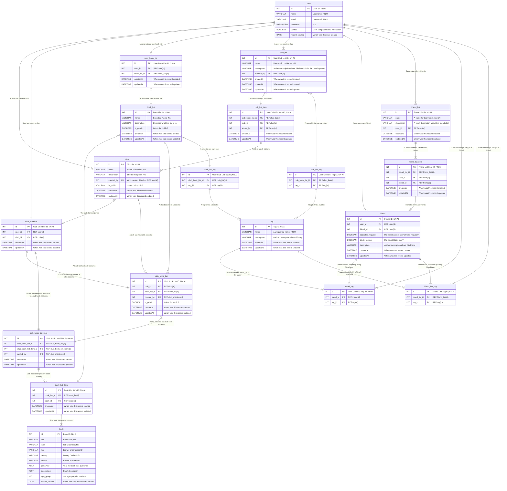

Documentation &raquo; Diagrams &raquo; Figure 3

---

# User Lists and Club Book Lists

```mermaid
erDiagram
    user {
        INT id PK "User ID; NN AI"
        VARCHAR name "username; NN U"
        VARCHAR email "user email; NN U"
        PASSWORD password "NN"
        BOOLEAN verified "User completed data verification"
        DATE record_created "When was this user created"
    }

    book {
        INT id PK "Book ID; NN AI"
        VARCHAR title "Book Title; NN"
        VARCHAR isbn "ISBN number; NN"
        VARCHAR loc "Library of congress ID"
        VARCHAR dewey "Dewey Decimal ID"
        VARCHAR edition "Edition of the book"
        YEAR pub_year "Year the book was published"
        TEXT description "Short description"
        INT age_group "Set age group for readers"
        DATE record_created "When was this book record created"
    }

    club {
        INT id PK "Club ID; NN AI"
        VARCHAR name "Name of the club; NN"
        VARCHAR description "Short description; NN"
        INT created_by FK "Who created this club; REF user(id)"
        BOOLEAN is_public "Is this club public?"
        DATETIME createdAt "When was this record created"
        DATETIME updatedAt "When was this record updated"
    }

    club_member {
        INT id PK "Club Member ID; NN AI"
        INT user_id FK "REF user(id)"
        INT club_id FK "REF club(id)"
        DATETIME createdAt "When was this record created"
        DATETIME updatedAt "When was this record updated"
    }


    book_list {
        INT id PK "Book List ID; NN AI"
        VARCHAR name "Book List Name ;NN"
        VARCHAR description "Describe what this list is for"
        BOOLEAN is_public "Is this list public?"
        DATETIME createdAt "When was this record created"
        DATETIME updatedAt "When was this record updated"
    }

    book_list_item {
        INT id PK "Book List Item ID; NN AI"
        INT book_list_id FK "REF book_list(id)"
        INT book_id FK "REF book(id)"
        DATETIME createdAt "When was this record created"
        DATETIME updatedAt "When was this record updated"
    }

    user_book_list {
        INT id PK "User Book List ID; NN AI"
        INT user_id FK "REF user(id)"
        INT book_list_id FK "REF book_list(id)"
        DATETIME createdAt "When was this record created"
        DATETIME updatedAt "When was this record updated"
    }

    club_book_list {
        INT id PK "Club Book List ID; NN AI"
        INT club_id FK "REF club(id)"
        INT book_list_id FK "REF book_list(id)"
        INT created_by FK "REF club_member(id)"
        BOOLEAN is_public "Is this list public?"
        DATETIME createdAt "When was this record created"
        DATETIME updatedAt "When was this record updated"
    }

    club_book_list_item {
        INT id PK "Club Book List ITEM ID; NN AI"
        INT club_book_list_id FK "REF club_book_list(id)"
        INT club_book_list_item_id FK "REF club_book_list_item(id)"
        INT added_by FK "REF club_member(id)"
        DATETIME createdAt "When was this record created"
        DATETIME updatedAt "When was this record updated"
    }

    tag {
        INT id PK "Tag ID; NN AI"
        VARCHAR name "A unique tag name; NN U"
        VARCHAR description "A short description about this tag"
        DATETIME createdAt "When was this record created"
        DATETIME updatedAt "When was this record updated"
    }

    club_list {
        INT id PK "User Club List ID; NN AI"
        VARCHAR name "User Club List Name; NN"
        VARCHAR description "A short description about this list of clubs the user is part of"
        INT created_by FK "REF user(id)"
        DATETIME createdAt "When was this record created"
        DATETIME createdAt "When was this record created"
        DATETIME updatedAt "When was this record updated"
    }

    club_list_item {
        INT id PK "User Club List Item ID; NN AI"
        INT club_book_list_id FK "REF club_list(id)"
        INT club_id FK "REF club(id)"
        INT added_by FK "REF user(id)"
        DATETIME createdAt "When was this record created"
        DATETIME updatedAt "When was this record updated"
    }

    club_list_tag {
        INT id PK "User Club List Tag ID; NN AI"
        INT club_book_list_id FK "REF club_list(id)"
        INT tag_id FK "REF tag(id)"
    }

    book_list_tag {
        INT id PK "User Club List Tag ID; NN AI"
        INT club_book_list_id FK "REF club_list(id)"
        INT tag_id FK "REF tag(id)"
    }

    friend {
        INT id PK "Friend ID; NN AI"
        INT user_id FK "REF user(id)"
        INT friend_id FK "REF user(id)"
        BOOLEAN accepted_request "Did friend accept user's friend request?"
        BOOLEAN block_request "Did friend block user?"
        VARCHAR description "A short description about this friend"
        DATETIME createdAt "When was this record created"
        DATETIME updatedAt "When was this record updated"
    }

    friend_list {
        INT id PK "Friend List ID; NN AI"
        VARCHAR name "A name for this friends list; NN"
        VARCHAR description "A short description about this friends list"
        INT user_id FK "REF user(id)"
        DATETIME createdAt "When was this record created"
        DATETIME updatedAt "When was this record updated"
    }

    friend_list_item {
        INT id PK "Friend List Item ID; NN AI"
        INT friend_list_id FK "REF friend_list(id)"
        INT user_id FK "REF user(id)"
        INT friend_id FK "REF friend(id)"
        DATETIME createdAt "When was this record created"
        DATETIME updatedAt "When was this record updated"
    }

    friend_tag {
        INT id PK "User Club List Tag ID; NN AI"
        INT friend_id FK "REF friend(id)"
        INT tag_id FK "REF tag(id)"
    }
    
    friend_list_tag {
        INT id PK "Friend List Tag ID; NN AI"
        INT friend_list_id FK "REF friend_list(id)"
        INT tag_id FK "REF tag(id)"
    }

    user ||--|{ club : "A user can create a club"
    user }|--|| club_member : "User is a club member"
    club }|--|| club_member : "The club the user joined"

    user ||--|{ user_book_list : "User creates a user book list"
    user_book_list }|--|| book_list : "A user book list is a book list"
    book_list }|--|| book_list_item : "A book list has book list items"
    book_list_item ||--|{ book : "The book list items are books"

    club        ||--|{ club_book_list : "A club can have club book list"
    book_list   ||--|{ club_book_list : "A club book list is a book list"
    club_member ||--|{ club_book_list : "Club members can create a club book list"
    club_book_list }|--|| club_book_list_item : "A club book list has club book list items"
    club_member }|--|| club_book_list_item : "A club members can add items to a club book list items"
    club_book_list_item ||--|{ book_list_item : "Club Book List Items are Book List Items"

    user ||--|{ club_list : "A user can create a club"
    club_list }|--|| club_list_item : "A user book list is a book list"
    club_list_item ||--|{ club : "A club is a club list item"
    club_list }|--|| club_list_tag : "A user club list can have tags"
    club_list_tag ||--|{ tag : "A tag to find a club list"

    book_list }|--|| book_list_tag : "A book list can have tags"
    book_list_tag ||--|{ tag : "A tag to find a book list"

    user ||--|{ friend : "A user can make friends"
    user ||--|{ friend_list : "Can create a list of friends"
    friend_list ||--|{ friend_list_item : "A friend list has a list of friend items"
    friend_list_item ||--|{ friend : "friend list items are friends"

    user ||--|{ friend_tag : "A user can assign a tag to a friend"
    friend ||--|{ friend_tag : "Friends can be looked up using friend tags"
    tag ||--|{ friend_tag : "A tag associated with a friend by a user"

    user ||--|{ friend_list_tag : "A user can assign a tag to a friend"
    friend ||--|{ friend_list_tag : "Friends can be looked up using friend tags"
    tag ||--|{ friend_list_tag : "A tag associated with a friend by a user"

```
