# User Favorites and Follows

A user can follow and mark favorite (bookmark) some data objects

## Favorites

Favorites are things you want to keep around. You don't subscribe to them like follows.

- Tags
- Books
- Authors
- Clubs
- Threads
- Posts

## Follows

Followed items can be included as part of an Email news letter.

- Tags
- Category
- Clubs
- Boards
- Threads

## ER Diagram

```mermaid
erDiagram
    user {
        INT id PK "User ID; NN AI"
        VARCHAR name "username; NN U"
        VARCHAR email "user email; NN U"
        PASSWORD password "NN"
        BOOLEAN verified "User completed data verification"
        DATE record_created "When was this user created"
    }

    author {
        INT id PK "Author ID; NN AI"
        VARCHAR first_name "NN"
        VARCHAR last_name "NN"
        VARCHAR pen_name "Does this author have a nom de plume?"
        DATE dob "Date of birth"
        DATE dod "Date of death"
        TEXT author_info "A short biography of the author"
        DATE record_created "When was this author record created"
    }

    book {
        INT id PK "Book ID; NN AI"
        VARCHAR title "Book Title; NN"
        VARCHAR isbn "ISBN number; NN"
        VARCHAR loc "Library of congress ID"
        VARCHAR dewey "Dewey Decimal ID"
        VARCHAR edition "Edition of the book"
        YEAR pub_year "Year the book was published"
        TEXT description "Short description"
        INT age_group "Set age group for readers"
        DATE record_created "When was this book record created"
    }

    club {
        INT id PK "Club ID; NN AI"
        VARCHAR name "Name of the club; NN"
        VARCHAR description "Short description; NN"
        INT created_by FK "Who created this club; REF user(id)"
        DATE club_created "When was this club created"
        BOOLEAN is_public "Is this club public?"
    }

    user_favorite_books {
        INT id PK "Fav. Book ID; NN AI"
        INT user_id FK "REF user(id)"
        INT book_id FK "REF book(id)"
        
    }
    user   ||--o{ user_favorite_books   : "User has favorite books"
    user_favorite_books   }o--|| book   : "A book could be have many fans"


    user_favorite_authors {
        INT id PK "Fav. Author ID; NN AI"
        INT user_id FK "REF user(id)"
        INT author_id FK "REF author(id)"
    }
    user   ||--o{ user_favorite_authors : "User has favorite authors"
    user_favorite_authors }o--|| author : "An author could have many fans"

    user_favorite_club {
        INT id PK "Fav. Club ID; NN AI"
        INT user_id FK "REF user(id)"
        INT club_id FK "REF author(id)"
    }
    user   ||--o{ user_favorite_club    : "Has a favorite club"
    user_favorite_club    }o--||  club  : "Has a club fan"

    user_favorite_board {
        INT id PK "Favorite Board ID; NN AI"
        INT user_id FK "REF user(id)"
        INT board_id FK "REF club_board(id)"
    }
    user_favorite_topic {
        INT id PK "Favorite Topic ID; NN AI"
        INT user_id FK "REF user(id)"
        INT topic_id FK "REF club_topic(id)"
    }
    user_favorite_post {
        INT id PK "Favorite Post ID; NN AI"
        INT user_id FK "REF user(id)"
        INT post_id FK "REF club_post(id)"
    }
    user ||--|{ user_favorite_board : "Has a list of favorite boards"
    user ||--|{ user_favorite_topic : "Has a list of favorite topics"
    user ||--|{ user_favorite_post : "Has a list of favorite posts"
    user_favorite_board }o--|| club_board : "A user can add/remove boards to their favorites"
    user_favorite_topic }o--|| club_topic : "A user can add/remove topics to their favorites"
    user_favorite_post  }o--|| club_post : "A user can add/remove posts to their favorites"

    user_follow_club {
        INT id PK "Follow Board ID; NN AI"
        INT user_id FK "REF user(id)"
        INT club_id FK "REF club(id)"
    }
    user_follow_board {
        INT id PK "Follow Board ID; NN AI"
        INT user_id FK "REF user(id)"
        INT board_id FK "REF club_board(id)"
    }
    user_follow_topic {
        INT id PK "Follow Topic ID; NN AI"
        INT user_id FK "REF user(id)"
        INT topic_id FK "REF club_topic(id)"
    }

    user ||--|{ user_follow_club : "Has a list of clubs they would like to follow"
    user ||--|{ user_follow_board : "Has a list of boards they would like to follow"
    user ||--|{ user_follow_topic : "Has a list of topics (threads) they would like to follow"
    user_follow_club }o--|| club : "A user can follow a club"    
    user_follow_board }o--|| club_board : "A user can follow a board"    
    user_follow_topic }o--|| club_topic : "A user can follow a topic"

    club_board {
        INT id PK "Message Board IDl NN AI"
        VARCHAR name "NN"
        VARCHAR about ""
        INT order "Arrange the boards in order; NN U"
        INT created_by FK "Who created this board; REF club_member(id)"
        DATE board_created "NN"
        BOOLEAN is_public "Is this board public?"
        BOOLEAN is_closed "Is this board closed?"
        BOOLEAN is_sticky "Keep this board on top"
        INT closed_by "Who closed this board?; REF club_administrator(id)"
        DATE closed_when "When was this board closed?"
        BOOLEAN is_hidden "Is this board hidden?"
        INT hidden_by "Who hid this topic?; REF club_administrator(id)"
        DATE hidden_when "When was this board hidden?"
        VARCHAR hidden_why "Why was this board hidden?"
    }

    club_topic {
        INT id PK "Topic ID; NN AI"
        VARCHAR subject "NN"
        INT created_by FK "Who created this topic; REF club_member(id)"
        DATE topic_created "NN"
        BOOLEAN has_poll "Does this topic have a poll?"
        BOOLEAN is_public "Is this topic public?"
        BOOLEAN is_closed "Is this topic closed?"
        BOOLEAN is_sticky "Keep this topic on top"
        INT closed_by "Who closed this topic?; REF club_moderator(id)"
        DATE closed_when "When was this topic closed?"
        VARCHAR closed_why "Why was this topic closed?"
        BOOLEAN is_hidden "Is this topic hidden?"
        INT hidden_by "Who hid this topic?; REF club_moderator(id)"
        DATE hidden_when "When was this topic hidden?"
        VARCHAR hidden_why "Why was this topic hidden?"
        INT board_id "REF club_board(id)"
   }

   club_post {
        INT id PK "(overall) Post ID; NN AI"
        INT topic_id FK "REF club_topic(id)"
        INT created_by FK "Who created this post; REF club_member(id)"
        TEXT post_content "NN"
        INT post_number "Track the order of posts; NN"
        BOOLEAN is_public "Is this post public?"
        BOOLEAN is_sticky "Keep this post on top"
        BOOLEAN is_hidden "Is this post hidden by a moderator?"
        INT hidden_by "Who hid this post?; REF club_moderator(id)"
        DATE hidden_when "When was this post hidden?"
        VARCHAR hidden_why "Why was this post hidden?"
    }

    category {
        INT id PK "Category ID; NN AI"
        VARCHAR name "A unique category name; NN U"
        VARCHAR description "A short description about this category"
        DATE record_created "When was this category created"
    }

    tag {
        INT id PK "Tag ID; NN AI"
        VARCHAR name "A unique tag name; NN U"
        VARCHAR description "A short description about this tag"
        DATE record_created "When was this tag created"
    }

    user_favorite_tag {
        INT id PK "Fav. Tag ID; NN AI"
        INT user_id FK "REF user(id)"
        INT tag_id FK "REF tag(id)"
        
    }
    user   ||--o{ user_favorite_tag   : "User has favorite tags"
    user_favorite_tag   }o--|| tag   : "A tag could be have many fans"

    user_favorite_category {
        INT id PK "Fav. Category ID; NN AI"
        INT user_id FK "REF user(id)"
        INT category_id FK "REF tag(id)"
        
    }
    user   ||--o{ user_favorite_category   : "User has favorite categorys"
    user_favorite_category   }o--|| category   : "A category could be have many fans"

    user_follow_tag {
        INT id PK "Follow Tag ID; NN AI"
        INT user_id FK "REF user(id)"
        INT tag_id FK "REF tag(id)"
    }
    user ||--|{ user_follow_tag : "Has a list of tags they would like to follow"
    user_follow_tag }o--|| tag : "A user can follow a tag"    

    user_follow_category {
        INT id PK "Follow Category ID; NN AI"
        INT user_id FK "REF user(id)"
        INT category_id FK "REF category(id)"
    }

    user ||--|{ user_follow_category : "Has a list of category they would like to follow"
    user_follow_category }o--|| category : "A user can follow a category"    
```

