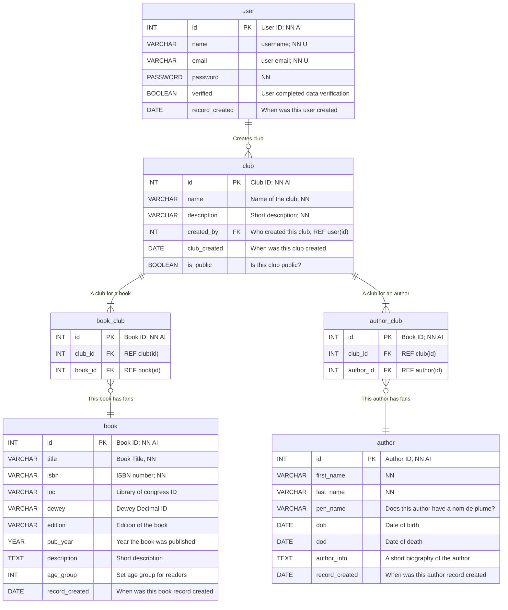

# Clubs

```mermaid
erDiagram
    user {
        INT id PK "User ID; NN AI"
        VARCHAR name "username; NN U"
        VARCHAR email "user email; NN U"
        PASSWORD password "NN"
        BOOLEAN verified "User completed data verification"
        DATE record_created "When was this user created"
    }

    author {
        INT id PK "Author ID; NN AI"
        VARCHAR first_name "NN"
        VARCHAR last_name "NN"
        VARCHAR pen_name "Does this author have a nom de plume?"
        DATE dob "Date of birth"
        DATE dod "Date of death"
        TEXT author_info "A short biography of the author"
        DATE record_created "When was this author record created"
    }

    book {
        INT id PK "Book ID; NN AI"
        VARCHAR title "Book Title; NN"
        VARCHAR isbn "ISBN number; NN"
        VARCHAR loc "Library of congress ID"
        VARCHAR dewey "Dewey Decimal ID"
        VARCHAR edition "Edition of the book"
        YEAR pub_year "Year the book was published"
        TEXT description "Short description"
        INT age_group "Set age group for readers"
        DATE record_created "When was this book record created"
    }

    club {
        INT id PK "Club ID; NN AI"
        VARCHAR name "Name of the club; NN"
        VARCHAR description "Short description; NN"
        INT created_by FK "Who created this club; REF user(id)"
        DATE club_created "When was this club created"
        BOOLEAN is_public "Is this club public?"
    }

    book_club {
        INT id PK "Book ID; NN AI"
        INT club_id FK "REF club(id)"
        INT book_id FK "REF book(id)"
    }
    author_club {
        INT id PK "Book ID; NN AI"
        INT club_id FK "REF club(id)"
        INT author_id FK "REF author(id)"
    }

    user   ||--o{ club : "Creates club"
    club ||--|{ book_club : "A club for a book"
    club ||--|{ author_club : "A club for an author"
    book_club }o--|| book : "This book has fans"
    author_club }o--|| author : "This author has fans"

```

## Club Membership

```mermaid
erDiagram
    user {
        INT id PK "User ID; NN AI"
        VARCHAR name "username; NN U"
        VARCHAR email "user email; NN U"
        PASSWORD password "NN"
        BOOLEAN verified "User completed data verification"
        DATE record_created "When was this user created"
    }

    club {
        INT id PK "Club ID; NN AI"
        VARCHAR name "Name of the club; NN"
        VARCHAR description "Short description; NN"
        INT created_by FK "Who created this club; REF user(id)"
        DATE club_created "When was this club created"
        BOOLEAN is_public "Is this club public?"
        INT club_administrator FK "Who is the current club admin.?  REF club_administrator(id)"
    }
    user ||--|{ club  : "Creates a club"
    club }|--|| club_administrator : "Administrates a club"

    club_administrator {
        INT id PK "Book ID; NN AI"
        INT club_id FK "REF club(id)"
        INT user_id FK "Who is this administrator; REF user(id)"
        INT created_by FK "Who made them administrator; REF user(id)"
    }

    club_administrator_supervisor {
        INT id PK "Administrator Supervisor ID"
        INT site_moderator_id FK "REF site_moderator(id)"
        INT administrator_id FK "REF club_administrator(id)"
    }

    user ||--|{ staff_user : "Staff users are users"
    staff_user ||--|{ site_administrator : "The site administrator is still a staff user"
    staff_user ||--|{ site_moderator : "The site moderators are users"
    site_administrator ||--|{ site_moderator : "The site administrator has jurisdiction over everyone!"
    site_moderator ||--|{ club_administrator_supervisor : "The site staff mod. has jurisdiction over the club admins"
    club_administrator_supervisor }|--|| club_administrator : ""

    club_moderator {
        INT id PK "Book ID; NN AI"
        INT club_id FK "REF club(id)"
        INT user_id FK "Who is this moderator; REF user(id)"
        INT created_by FK "Who made them moderator; REF user(id)"
    }

    club_moderator_supervisor {
        INT id PK "Moderator Supervisor ID"
        INT administrator_id FK "REF club_administrator(id)"
        INT moderator_id FK "REF club_moderator(id)"
    }
    club_administrator ||--|{ club_moderator_supervisor : "Club Admin. is the supervisor"
    club_moderator_supervisor }|--|| club_moderator : "Club mods. are supervised"

    club_member {
        INT id PK "Club Member ID; NN AI"
        INT club_id FK "REF club(id)"
        INT user_id FK "Who is this member; REF user(id)"
        BOOLEAN invited "Were they invited. (If not, assume they joined on their own.)"
        INT created_by FK "Who authorized them to join; REF user(id)"
        BOOLEAN can_create_polls "Can this user create a poll?"
    }
    user ||--|{ club_member : "user is a club member"
    user ||--|{ club_moderator : "user is a mod."
    user ||--|{ club_administrator : "user is an admin."

    club_member_advisor {
        INT id PK "Member Supervisor ID"
        INT moderator_id FK "REF club_moderator(id)"
        INT member_id FK "REF club_member(id)"
    }
    club_moderator ||--|{ club_member_advisor : "Club Mod. is the advisor"
    club_member_advisor ||--|{ club_member : "Club members are advised"
    
    club_board_moderator {
        INT id PK "Club Board Moderator ID"
        INT board_id "REF club_board(id)"
        INT moderated_by "REF club_moderator(id)"
    }
    club_moderator ||--|{ club_board_moderator : "Club Mods moderate boards"

    club_board {
        INT id PK "Message Board IDl NN AI"
        VARCHAR name "NN"
        VARCHAR about ""
        INT created_by FK "Who created this board; REF club_member(id)"
        DATE board_created "NN"
        BOOLEAN is_public "Is this board public?"
        BOOLEAN is_closed "Is this board closed?"
        INT closed_by "Who closed this board?; REF club_moderator(id)"
        DATE closed_when "When was this board closed?"
    }
    club_board_moderator ||--|{ club_board : "Each board has at least one moderator"
    club ||--|{ club_board : "Clubs contain boards"

    club_topic {
        INT id PK "Topic ID; NN AI"
        VARCHAR subject "NN"
        INT created_by FK "Who created this topic; REF club_member(id)"
        DATE topic_created "NN"
        BOOLEAN has_poll "Does this topic have a poll?"
        BOOLEAN is_public "Is this topic public?"
        BOOLEAN is_closed "Is this topic closed?"
        INT closed_by "Who closed this topic?; REF club_moderator(id)"
        DATE closed_when "When was this topic closed?"
        INT board_id "REF club_board(id)"
   }
    club_board ||--o{ club_topic : "Boards contain topics"
    club_moderator ||--|{ club_topic : "Can moderate topic"
    club_member ||--|{ club_topic : "creates a topic"


    club_post {
        INT id PK "(overall) Post ID; NN AI"
        INT topic_id FK "REF club_topic(id)"
        INT created_by FK "Who created this post; REF club_member(id)"
        TEXT post_content "NN"
        INT post_number "Track the order of posts; NN"
        BOOLEAN is_public "Is this post public?"
    }
    club_topic ||--o{ club_post : "contains"
    club_member ||--|{club_post : "writes"

    club_reply {
        INT id PK "(overall) Reply ID; NN AI"
        INT reply_from FK "REF club_post(id)"
        INT reply_to   FK "REF club_post(id)"
    }
    club_post  ||--o{ club_reply : "reply_from"
    club_reply ||--o{ club_post : "reply_to"

    club_poll {
        INT id PK "Poll ID; NN AI"
        INT topic_id FK "club_topic(id)"
        VARCHAR question "Poll Question; NN"
        INT created_by FK "Who created this poll; REF user(id)"
        DATE poll_created "NN"
        DATE poll_expires "NN"
    }

    club_poll_item {
        INT id PK "Poll Item ID; NN AI"
        VARCHAR answer "NN"
        INT votes "NN"
    }
    club_member ||--|{ club_poll : "Can create a poll"
    club_topic }|--|| club_poll : "Could have a poll"
    club_poll ||--|{ club_poll_item : "Has options"
```

```mermaid
erDiagram
    club_member_request {}
    club_member_mutes {}
    club_member_bans {}
```