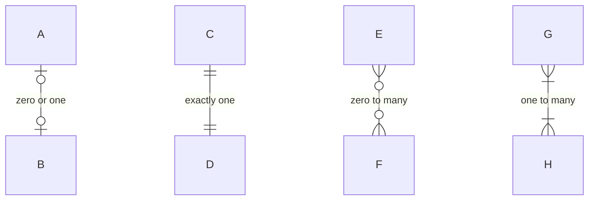
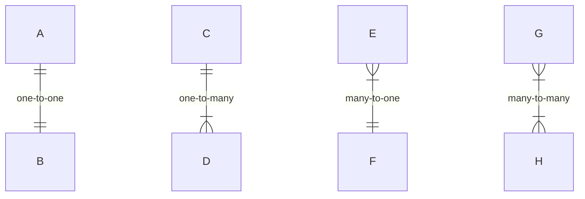
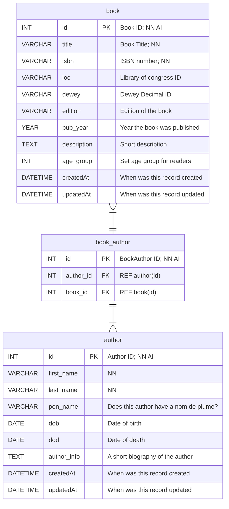

# Relationships between Models

It occured to me that some of my relationships may have been incorrect.

So here's a quick review.

> Note: In this diagram we are just showing what the SYMBOLS mean

| Value (left) | Value (right) | Meaning |
|--------------|---------------|---------|
| `\|o` | `o\|` | Zero or one |
| `\|\|` | `\|\|` | Exactly one |
| `}o` | `o{` | Zero or more (no upper limit) |
| `}\|` | `\|{` | One or more (no upper limit) |

We will have four types of relations

| Relationship | Value      | Meaning | Example |
|--------------|------------|---------|---------|
| `A \|\|--\|\| B` | one-to-one | One record in Table A is related to one record in Table B.  | A User has exactly one Password |
| `A \|\|--\|{ B` | one-to-many | One record in Table A is related to one or more records in Table B.  | A Class has many Students |
| `B }\|--\|\| A` | many-to-one | Many records in Table B are related to one record in Table A.  | Many Students have the same Class |
| `A }\|--\|{ B` | many-to-many | Many records in Table A are related to many records in Table B.  | many Books have many Authors |

A Link Table can bridge at least two other tables together.

With Link tables our relationship between `book`s and `author`s has a `book_author`

